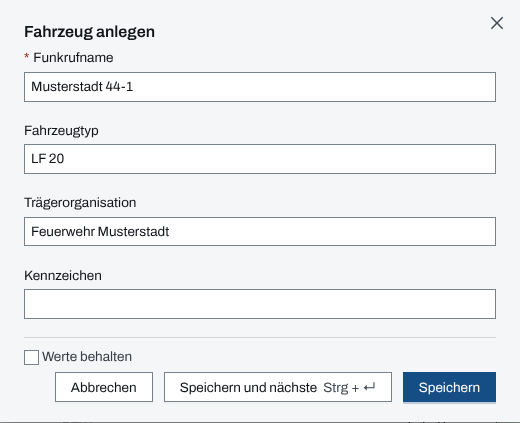
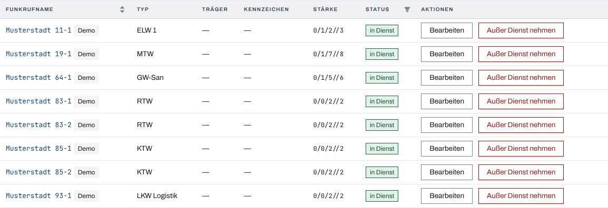
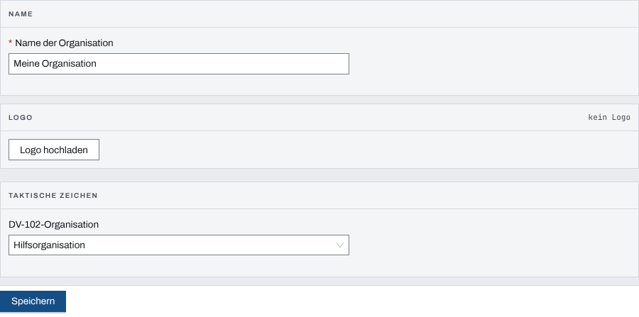

## Überblick

Stammdaten sind das, was eine Organisation über jeden Einsatz hinweg vorhält: Fahrzeuge,
Material und Personal, dazu die Kataloge, aus denen Einsätze schöpfen (Einsatz-Stichworte,
Qualifikationen, Status, ETB-Schnellbausteine, Einheitstypen, Sprechgruppen,
Führungsfunktionen), sowie Name, Logo und Zeichen der Organisation. Im Einsatz werden daraus
Kräfte disponiert und Einträge vorbelegt.

Gepflegt werden die Stammdaten in der Verwaltung unter „Stammdaten“, und zwar nur von
System-Admins. Führungskräfte der Organisation sehen sie zum Nachschlagen.

## Abläufe

### Ein Fahrzeug anlegen

1. Oben „Verwaltung“ öffnen und unter „Stammdaten“ „Fahrzeuge“ wählen.
2. „Fahrzeug anlegen“ wählen.
3. „Funkrufname“ eintragen, dazu nach Bedarf „Fahrzeugtyp“, „Trägerorganisation“ und
   „Kennzeichen“.

   

4. „Speichern“ wählen, oder „Speichern und nächste“ (Strg+Enter), um gleich das nächste
   Fahrzeug zu erfassen. Ist „Werte behalten“ angehakt, bleibt dabei die Trägerorganisation
   stehen.

Personal („Person anlegen“) und Material („Material anlegen“) werden auf dieselbe Weise
angelegt.

### Ein Fahrzeug außer Dienst nehmen

1. Unter „Stammdaten“ „Fahrzeuge“ öffnen.
2. In der Zeile des Fahrzeugs „Außer Dienst nehmen“ wählen.

   

3. Ist das Fahrzeug wieder einsatzbereit, an derselben Stelle „Wieder in Dienst nehmen“ wählen.

Auf schmalen Bildschirmen liegen „Bearbeiten“ und der Dienstwechsel in einem Aktionsmenü je
Zeile. Für Personal und Material gilt dasselbe.

### Einen Katalog pflegen

Am Beispiel der Qualifikationen; Fahrzeug-Status, Personal-Status und Einheitstypen arbeiten
gleich:

1. Unter „Stammdaten“ „Qualifikationen“ öffnen.
2. Unter „Neue Qualifikation“ die Bezeichnung eintippen und „Qualifikation anlegen“ wählen.
3. Zum Ändern in der Zeile „Bearbeiten“ wählen.
4. Zum Entfernen „Deaktivieren“ wählen und die Rückfrage „Qualifikation deaktivieren?“ mit
   „Qualifikation deaktivieren“ bestätigen.

### Name, Logo und Zeichen der Organisation festlegen

1. Unter „Stammdaten“ „Organisation“ öffnen.
2. Unter „Name der Organisation“ den Namen eintragen.
3. Unter „Logo“ „Logo hochladen“ wählen und eine PNG- oder JPEG-Datei wählen; das Logo gilt
   sofort.
4. Unter „Taktische Zeichen“ die „DV-102-Organisation“ wählen.

   

5. „Speichern“ wählen.

„Logo entfernen“ fragt mit „Logo entfernen?“ nach, weil die Datei danach gelöscht ist.

### Führungsfunktionen umbenennen

1. Unter „Stammdaten“ „Führungsfunktionen“ öffnen.
2. Auf die Bezeichnung einer Funktion klicken, den eigenen Namen eintragen und mit Enter oder
   „Speichern“ übernehmen.
3. Für die Psychosoziale Notfallversorgung den Schalter „S7 PSNV eingeschaltet“ umlegen.

Eine leer gespeicherte Bezeichnung stellt das Standardlabel wieder her. Eine geänderte
Bezeichnung zeigt das Standardlabel als „(Vorgabe: …)“ dahinter.

## Hintergrund

### Wer was darf

Nur System-Admins legen an, ändern und deaktivieren. Führungskräfte der Organisation sehen jede
Stammdaten-Seite mit dem Hinweis „Nur Ansicht · nur System-Admin“. Andere Personen erreichen die
Verwaltung nicht.

### Außer Dienst und deaktiviert

- **Außer Dienst nehmen** fragt nicht nach, weil es umkehrbar ist. Ein Fahrzeug außer Dienst
  lässt sich in keinem Einsatz neu disponieren. Wo es schon disponiert ist, bleibt es stehen und
  zeigt den Stand von damals; nach „Wieder in Dienst nehmen“ wieder die aktuellen Stammdaten.
- **Deaktivieren** nimmt einen Katalogeintrag aus der Auswahl. Bestehende Zuordnungen bleiben
  gültig.

### Demo-Stammdaten

Stammdaten, die mit den Demo-Daten kamen, tragen die Marke „Demo“. Das Kapitel
[Demo-Daten](demo-daten.md) beschreibt, was beim Entfernen mit ihnen geschieht.

### Logo und Zeichen

- Das Logo erscheint im Kopf jedes Ausdrucks. Es darf höchstens 1 MiB groß sein; der Server
  prüft es vor dem Speichern auf Schadsoftware.
- Die „DV-102-Organisation“ ist die Vorgabe für taktische Zeichen auf der Lagekarte, an denen
  keine eigene Organisation steht.

### Führungsfunktionen

Der Katalog ist fest: Einsatzleitung, die Sachgebiete S1 bis S6, auf Wunsch S7,
Führungshilfspersonal und Fachberater. Neue Funktionen lassen sich nicht anlegen, nur die
Bezeichnungen der vorhandenen an die eigene Organisation anpassen. Die Bezeichnungen erscheinen
überall, wo der Einsatz Führungsfunktionen nennt.

## Grundlagen und Quellen

- **FwDV 100**, Anlage 1 und 2: Katalog der Führungsfunktionen und Sachgebiete S1 bis S6.
- **DV 102**: taktische Zeichen; die „DV-102-Organisation“ wählt die Organisation des Zeichens.
