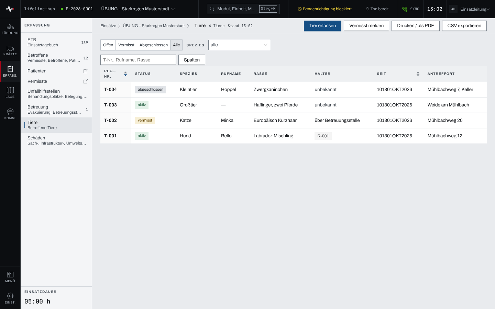
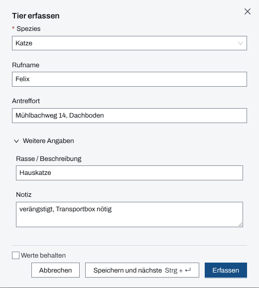
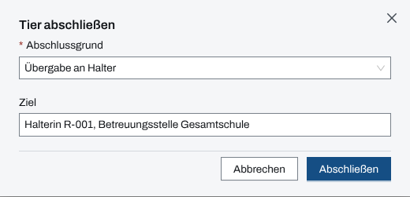

## Überblick

Das Modul „Tiere“ führt die Tiere, die im Einsatz angetroffen, versorgt oder vermisst werden: vom
Hund aus einer geräumten Wohnung bis zu Pferden auf einer überfluteten Weide. Jedes Tier bekommt
eine Registriernummer (T-001, T-002 …), eine Spezies und einen Status: „aktiv“ (in Obhut des
Einsatzes), „vermisst“ oder „abgeschlossen“. Ein Tier lässt sich einer betroffenen Person als
Halter zuordnen.

## Abläufe

### Die Tiere im Einsatz ablesen

1. Im Modulpanel „Tiere“ öffnen. Die Liste zeigt je Tier Registriernummer, Status, Spezies,
   Rufname, Rasse, Halter, seit wann es geführt wird und den Antreffort.

   

2. Die Leiste „Offen“, „Vermisst“, „Abgeschlossen“, „Alle“ wählt die Sicht; „Offen“ zeigt die
   aktiven Tiere. Daneben engt „Spezies“ die Liste ein, die Suche findet T-Nr., Rufname und
   Rasse.
3. Ein Klick auf eine Zeile öffnet die Seite des Tiers.

### Ein Tier erfassen

1. „Tier erfassen“ wählen.
2. Die „Spezies“ wählen („Hund“, „Katze“, „Großtier“, „Nutzgeflügel“, „Kleintier“, „Wildtier“,
   „Sonstige“), dazu „Rufname“ und „Antreffort“, soweit bekannt.
3. Unter „Weitere Angaben“ bei Bedarf „Rasse / Beschreibung“ und „Notiz“ ergänzen.

   

4. „Erfassen“ wählen. Das Tier steht als „aktiv“ in der Liste.

An einer Sammelstelle kommen Tiere oft nacheinander: „Speichern und nächste“ hält den Dialog
offen, mit „Werte behalten“ bleiben Spezies und Antreffort stehen.

### Ein vermisstes Tier melden und als aufgefunden markieren

1. „Vermisst melden“ wählen. Der Dialog fragt dasselbe ab wie „Tier erfassen“; unter „Weitere
   Angaben“ kommen „Farbe / Erscheinung“, „Kennzeichnung“ (Chip, Tätowierung, Halsband) und
   „Halter-Kontakt“ dazu.
2. „Erfassen“ wählen. Das Tier steht unter „Vermisst“.
3. Wird es gefunden, die Seite des Tiers öffnen und „Aufgefunden“ wählen. Das Tier steht wieder
   als „aktiv“ in der Liste.

Ein aktives Tier, das entlaufen ist, setzt „Als vermisst markieren“ auf „vermisst“.

### Einen Halter zuordnen

1. Die Seite des Tiers öffnen und „Bearbeiten“ wählen.
2. Im Feld „Halter“ eine betroffene Person (R-Nr.) wählen, oder einen Namen schreiben und „Als
   externen Kontakt: „…““ wählen.
3. „Speichern“ wählen.

Umgekehrt ordnet „Tier zuweisen“ auf der Seite einer betroffenen Person ein Tier zu, das noch
keinen Halter hat. Die Liste der Tiere zeigt den Halter dann mit seiner Registriernummer.

### Ein Tier abschließen

1. Die Seite des Tiers öffnen und „Abschließen“ wählen.
2. Den „Abschlussgrund“ wählen: „Übergabe an Halter“, „Übergabe an Tierarzt“, „Übergabe an
   Tierheim“, „verstorben“, „Freilauf“ oder „Sonstiges“. Unter „Ziel“ eintragen, wohin das Tier
   gegangen ist.

   

3. „Abschließen“ wählen. Die Seite des Tiers zeigt Grund und Ziel unter „Abschluss“.

Ein abgeschlossenes Tier lässt sich wieder öffnen: „→ aktiv“ oder „Als vermisst markieren“.

## Hintergrund

### Angaben am Tier

„Bearbeiten“ auf der Seite des Tiers zeigt alle Angaben, auch die, die der Erfassungsdialog nicht
abfragt: „Geschlecht“, „Alter in Jahren (geschätzt)“, „Größe / Gewicht“. Fotos und Dateien zum
Tier liegen auf seiner Seite. „Stornieren“ nimmt eine Fehlerfassung aus der Liste.

### Einsatztagebuch

Das Einsatztagebuch führt Tiere nur mit Registriernummer und Spezies, ohne Rufname, Kennzeichnung,
Halter oder Ziel: „Tier T-… (Hund) erfasst“, „Tier T-… (Katze) als vermisst gemeldet“, „Tier T-…:
vermisst → aktiv (aufgefunden)“, der Abschluss mit seinem Grund und das Stornieren.

### Druck und Export

„Drucken / als PDF“ druckt die Liste in der gewählten Sicht und Spezies, „CSV exportieren“ gibt
alle nicht stornierten Tiere als Tabelle aus.

### Rechte

Erfassen und ändern dürfen Einsatzleitung und Führungspersonal eines laufenden Einsatzes
([Rechte im Einsatz](rechte-im-einsatz.md)). Lesen, drucken und exportieren dürfen alle, die das
Modul sehen.

### Ohne Netz

Die Tiere hält die App nicht für die Arbeit ohne Netz vor; erfassen und ändern gehen nur mit Netz
([Arbeiten ohne Netz](ohne-netz.md)).
