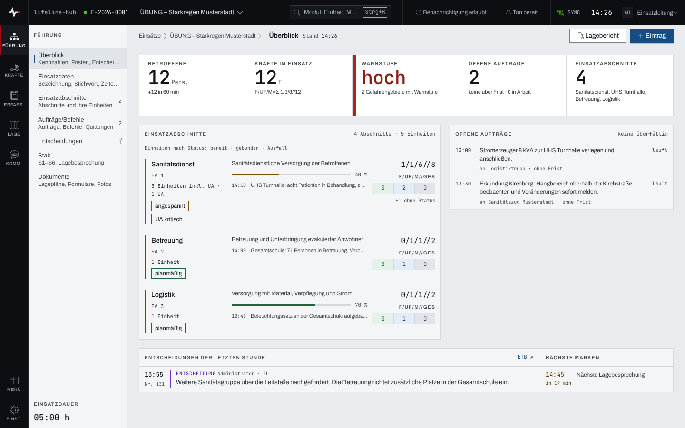

## Überblick

Der Überblick ist die Startseite eines Einsatzes im Bereich „Führung“. Er fasst auf einer Seite
zusammen, was die Führung zuerst wissen muss: die Lage in Zahlen, den Stand der
Einsatzabschnitte, offene Aufträge, die Entscheidungen der letzten Stunde und die nächsten
Fristen. Er rechnet nur aus Daten, die in den Modulen schon erfasst sind; erfasst wird in den
Modulen selbst.

## Abläufe

### Die Lage auf einen Blick lesen

1. Im Bereich „Führung“ „Überblick“ öffnen.
2. Im Kennzahlenband oben die Zahlen lesen: „Betroffene“ mit dem Zuwachs der letzten 60 Minuten,
   „Kräfte im Einsatz“ in der Stärke F/UF/M//Σ, die höchste „Warnstufe“ der Gefahrengebiete,
   „Offene Aufträge“ und die Zahl der „Einsatzabschnitte“.
3. Im Paneel „Einsatzabschnitte“ je Abschnitt den Lagezustand („planmäßig“, „angespannt“,
   „kritisch“), den festen Auftrag, den Fortschritt, die letzte Rückmeldung und die Einheiten nach
   Status lesen.

   

4. Rechts daneben „Offene Aufträge“ und darunter „Nächste Marken“ lesen: Was zuerst fällig ist,
   steht oben.
5. Im Paneel „Entscheidungen der letzten Stunde“ „ETB ↗“ wählen: Das Einsatztagebuch zeigt alle
   Entscheidungen.

### Vom Überblick weiterarbeiten

1. „Eintrag“ im Seitenkopf wählen: Das Einsatztagebuch öffnet sich mit der Erfassung, bereit für
   einen neuen Eintrag.
2. Zurück im Überblick „Lagebericht“ wählen: Die Liste der Lageberichte öffnet sich (Kapitel
   [Lageberichte](lageberichte.md)).

## Hintergrund

### Was die Zahlen bedeuten

- **Kräfte im Einsatz** zählt nur das Personal, nicht Fahrzeuge oder Material.
- **Warnstufe** ist die höchste Stufe aller Gefahrengebiete; darunter steht, wie viele Gebiete
  eine Warnstufe tragen (Kapitel [Gefahren](gefahren.md)). Ist ein Pegel festgelegt, steht dort
  auch sein Stand (Kapitel [Wetter und Pegel](wetter-pegel.md)).
- **Offene Aufträge** nennt dieselbe Zahl wie das Modul „Aufträge/Befehle“ und dazu, wie viele
  über ihrer Frist sind. Das Paneel zeigt höchstens acht, die überfälligen zuerst; alle weiteren
  erreicht „alle … offenen Aufträge ↗“.
- **Entscheidungen der letzten Stunde:** Gab es in der letzten Stunde keine, heißt das Paneel
  „Letzte Entscheidungen“ und zeigt die jüngsten fünf mit dem Hinweis „keine in der letzten
  Stunde“.
- Die Zahlen eines Abschnitts schließen seine Unterabschnitte ein; zusammen ergeben die Zeilen
  die Einsatzstärke. Kräfte ohne Abschnitt stehen in der Zeile „Ohne Abschnitt“ am Ende.

### Nächste Marken

Die Marken kommen aus sechs Quellen: Aufträge mit Frist, offene Erinnerungen, die nächste
Lagebesprechung, der erwartete Höchststand an einem maßgeblichen Pegel, fällige Ablösungen und der
Beginn angekündigter Unwetterwarnungen der Stufen schwer und extrem. Eine verstrichene Frist steht
als „überfällig“ ganz oben, eine Frist in weniger als 30 Minuten ist hervorgehoben. Pegelprognose
und Unwetterbeginn sind Erwartungen, keine Fristen: Verstrichen fallen sie heraus. Es stehen
höchstens sechs Marken da, der Rest als „+… weitere“.

### Rechte und gesperrte Module

Den Überblick lesen alle, die den Einsatz sehen. „Eintrag“ ist nur mit Schreibrecht wählbar, also
für Einsatzleitung und Führungspersonal eines laufenden Einsatzes (Kapitel
[Rechte im Einsatz](rechte-im-einsatz.md)). Ist ein Modul für die Person nicht freigegeben, steht
seine Zahl als „—“ mit „nicht freigegeben“, nie als 0.
