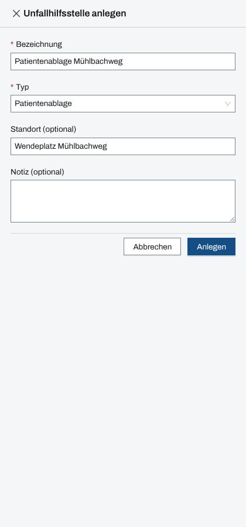
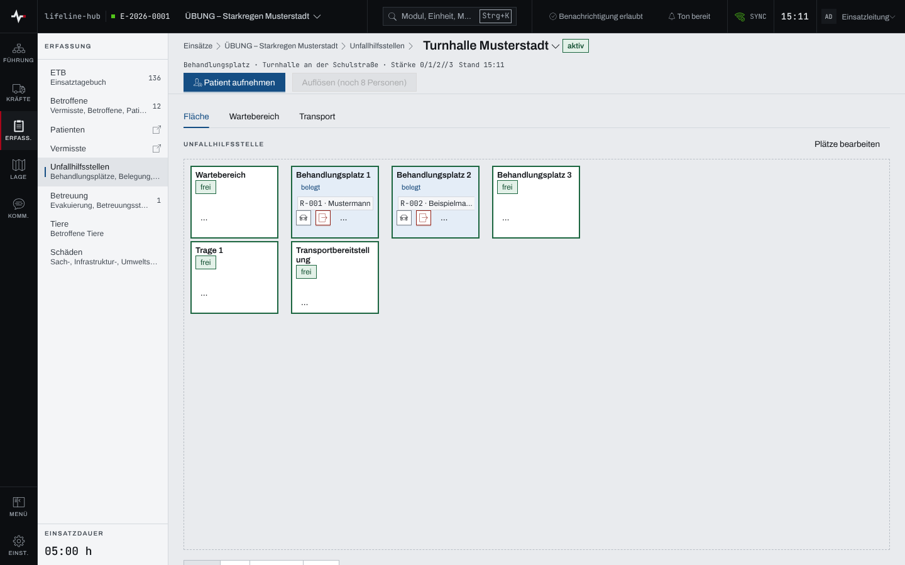
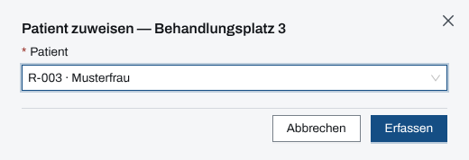

## Überblick

Eine Unfallhilfsstelle (UHS) ist ein Ort, an dem Patienten versorgt werden: Patientenablage,
Behandlungsplatz, Verletztensammelstelle oder Sonstige. Das Modul „Unfallhilfsstellen“ zeigt je
Stelle einen Grundriss mit ihren Plätzen, den Wartebereich am Eingang und wer die Stelle auf
Transport verlassen hat. Die Einsatzleitung sieht hier, welche Plätze frei und belegt sind und wer
noch wartet.

Die Patienten selbst sind Betroffene; ihre Sichtung und ihren Verbleib führt das Kapitel
[Betroffene und Sichtung](betroffene.md).

## Abläufe

### Eine Unfallhilfsstelle anlegen und in Betrieb nehmen

1. In der Liste der Unfallhilfsstellen „Neu“ wählen, oder im Titel einer Unfallhilfsstelle den
   Namen öffnen und „+ Neue UHS“ wählen.
2. „Bezeichnung“ und „Typ“ angeben, bei Bedarf „Standort (optional)“ und „Notiz (optional)“.

   

3. „Anlegen“ wählen. Die neue Stelle steht auf „geplant“.
4. Die Stelle öffnen und „Plätze anlegen“ wählen: den Platz-Typ (etwa „Behandlungsplatz“,
   „Trage“, „Bett“) und die „Menge“ angeben, dann „Anlegen“. Die Plätze werden durchnummeriert.
5. „In Betrieb nehmen“ wählen. Die Stelle steht auf „aktiv“ und nimmt Patienten auf.

Ein Lageplan als Hintergrund des Grundrisses lässt sich über „Plan“ hochladen oder aus den Dateien
der Stelle übernehmen (PNG, JPEG oder WebP). Im Betrieb stehen „Plan“ und „Plätze anlegen“ hinter
„Plätze bearbeiten“; dort lassen sich Plätze auch verschieben und löschen.

### Die Belegung ablesen

1. Im Modulpanel „Unfallhilfsstellen“ öffnen. Es öffnet sich die zuletzt besuchte oder eine
   aktive Stelle; andere wählt der Umschalter im Titel.

   

2. Die Fläche zeigt jeden Platz mit seiner Verfügbarkeit („frei“, „belegt“, „in Aufbereitung“,
   „defekt“, „gesperrt“) und dem Patienten darauf.
3. „Wartebereich“ zeigt, wer in der Stelle auf einen Platz wartet („Wartebereich (Eingang)“) und
   wer noch keiner Stelle zugeordnet ist („Noch nicht aufgenommen“). „Transport“ zeigt, wer die
   Stelle auf Transport verlassen hat („Auf Transport gebracht“).
4. Unter dem Grundriss führen „Material“, „Kräfte“, „Bewegungen“ und „Dateien“ zu den Angaben
   der Stelle; „Bewegungen“ listet jede Aufnahme, Verlegung und Entlassung mit Zeit und Platz.

Auf einem breiten Bildschirm stehen Wartebereich, Fläche und Transport nebeneinander; dann lassen
sich Patienten auch mit der Maus auf einen Platz ziehen.

### Einen Patienten aufnehmen und einem Platz zuweisen

1. „Patient aufnehmen“ wählen. Die Seite „Aufnahme“ hat dieselben Felder wie die Maske der
   Betroffenen.
2. Die Angaben eintragen und „Erfassen“ wählen. Der Patient steht danach im Wartebereich der
   Stelle; die Quittung nennt seine Registriernummer und „im Wartebereich“.
3. Auf der Fläche einen freien Platz anklicken oder in seinem Menü „Patient zuweisen“ wählen. Der
   Dialog „Patient zuweisen — …“ nennt den Platz.
4. Unter „Patient“ die Person wählen.

   

5. „Erfassen“ wählen. Der Platz steht auf „belegt“.

Zurück in den Wartebereich führt das Platzmenü („…“) mit „Zurück in den Wartebereich“.

### Einen Patienten entlassen oder auf Transport bringen

1. Am belegten Platz „Verbleib / Entlassung erfassen“ wählen (Symbol mit dem Fahrzeug).
2. Im Dialog „Verbleib erfassen — …“ das „Ziel“ eintragen und die „Art“ prüfen; vorgewählt ist
   „Transport“. Beim Transport das „Transportmittel (RTW/KTW …)“ angeben.
3. „Erfassen“ wählen. Der Patient verlässt die Stelle; bei „Transport“ steht er unter „Auf
   Transport gebracht“.
4. Der Platz steht danach auf „in Aufbereitung“. Ist er wieder bereit, „als frei markieren“
   wählen.

„zurückweisen“ nimmt einen Patienten aus der Stelle, ohne einen Verbleib zu erfassen; er steht
dann wieder unter „Noch nicht aufgenommen“.

### Eine Unfallhilfsstelle auflösen

1. Alle Patienten der Stelle entlassen, verlegen oder zurückweisen. Solange noch jemand in der
   Stelle ist, steht der Knopf als „Auflösen (noch … Personen)“ gesperrt.
2. „Auflösen“ wählen und die Rückfrage „Unfallhilfsstelle auflösen?“ bestätigen.

Eine Stelle, die noch „geplant“ ist, wird stattdessen mit „Stornieren“ verworfen.

## Hintergrund

### Status und Plätze

Eine Unfallhilfsstelle ist „geplant“, „aktiv“ oder „aufgelöst“. Nur eine aktive Stelle nimmt
Patienten auf. Verlässt ein Patient einen Platz, setzt die App den Platz von selbst auf „in
Aufbereitung“. Die Verfügbarkeit eines Platzes lässt sich im Platzmenü auch von Hand setzen
(„als frei markieren“, „als defekt markieren“, „als in Aufbereitung markieren“, „als gesperrt
markieren“).

Ein Verbleib „Transport“, „Notunterkunft“ oder „Entlassung vor Ort“ beendet den Aufenthalt in der
Stelle, ebenso der Status „verstorben“ oder „abgemeldet“ einer Person und ihr Stornieren, auch
wenn das im Modul „Betroffene“ geschieht.

### Einsatztagebuch

Das Einsatztagebuch vermerkt die Inbetriebnahme („… in Betrieb genommen“) und die Auflösung einer
Stelle sowie jede Bewegung eines Patienten, nur mit Registriernummer: „Person R-…: Aufnahme in …
(Inbox)“, „Person R-…: Verlegung in …“, „Person R-…: verlässt …“. Kräfte, die einer Stelle
zugeordnet oder von ihr abgezogen werden, stehen ebenfalls dort.

### Kräfte und Material

Der Kopf der Stelle nennt ihre Stärke. Unter „Kräfte“ werden Kräfte und Einheiten mit „Kraft
zuordnen“ und „Einheit zuordnen“ an die Stelle gesetzt, „Kraft erfassen“ legt eine Kraft neu an.
Unter „Material“ ordnet „Material zuordnen“ Material des Einsatzes der Stelle zu; erfasst wird es
im Modul „Material“.

### Rechte

Anlegen, Plätze einrichten, Patienten aufnehmen und bewegen dürfen Einsatzleitung und
Führungspersonal eines laufenden Einsatzes ([Rechte im Einsatz](rechte-im-einsatz.md)). Die
Bedienung an gekoppelten Tablets und Laptops einer Unfallhilfsstelle beschreibt
[UHS-Tablet und UHS-Laptop](geraet-uhs.md).

### Ohne Netz

Die Unfallhilfsstellen bleiben ohne Netz lesbar, und Patienten lassen sich über „Patient
aufnehmen“ erfassen; sie landen im Wartebereich, sobald die Verbindung zurück ist. Zuweisen,
Verlegen und Entlassen gehen nur mit Netz. Mehr in [Arbeiten ohne Netz](ohne-netz.md).
