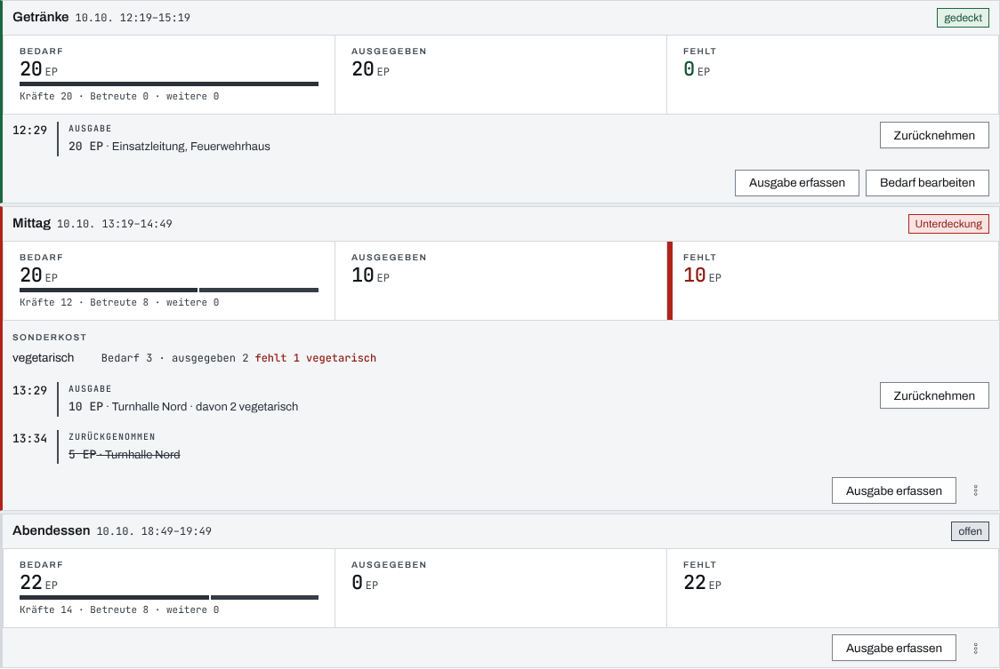
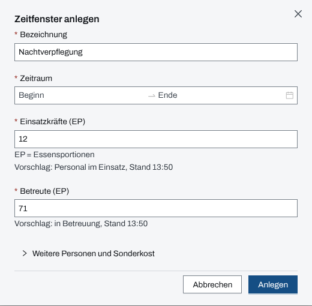
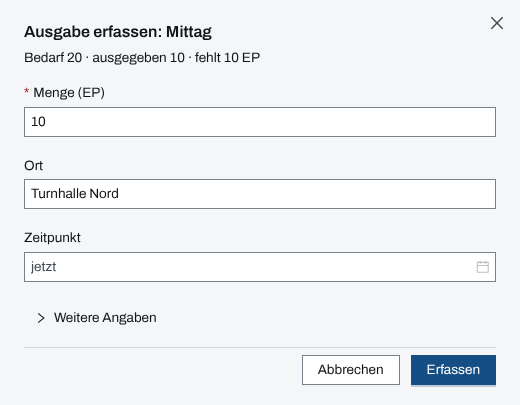

## Überblick

Das Modul **Verpflegung** plant die Essensportionen (EP) eines Einsatzes in **Zeitfenstern**. Je
Zeitfenster steht der Bedarf für Einsatzkräfte, Betreute und weitere Personen, davon die Sonderkost,
und dagegen stehen die Ausgaben. Die Seite zeigt je Zeitfenster, was ausgegeben ist und was fehlt,
und stuft es als „gedeckt“, „offen“ oder „Unterdeckung“ ein.

Dieses Kapitel beschreibt die Sicht der Einsatzleitung. Einsatzleitung und Führungspersonal legen
Zeitfenster an, erfassen Ausgaben und fordern nach, wenn etwas fehlt. Die Bedienung am gekoppelten
Gerät einer Verpflegungsstelle beschreibt das Kapitel „Verpflegung“ unter den gekoppelten Geräten.

## Abläufe

### Die Zeitfenster im Blick behalten

1. Unter „Kräfte & Mittel“ „Verpflegung“ öffnen. Im Seitenkopf steht, wie viele Zeitfenster es gibt
   und wie viele davon in Unterdeckung sind.
2. Unter „laufend & anstehend“ die Zeitfenster lesen, die noch nicht vorbei sind, nach Beginn
   geordnet. Je Karte stehen Bezeichnung, Zeitraum und rechts die Einstufung, darunter „Bedarf“ mit
   der Aufteilung, „ausgegeben“ und „fehlt“.

   

3. Unter „Sonderkost“ je Kostform Bedarf und Ausgabe lesen. Fehlt etwas, steht dort etwa „fehlt 1
   vegetarisch“.
4. Unter „vergangen“ die Zeitfenster nachlesen, deren Ende vorbei ist.

### Ein Zeitfenster anlegen

Für Einsatzleitung und Führungspersonal:

1. „Zeitfenster anlegen“ wählen.
2. „Bezeichnung“ eingeben, etwa „Mittag“, und unter „Zeitraum“ Beginn und Ende wählen.
3. „Einsatzkräfte (EP)“ und „Betreute (EP)“ prüfen. Die App schlägt die Zahlen vor und nennt
   darunter, woher sie stammen; jede Zahl lässt sich überschreiben.

   

4. Für weitere Personen oder Sonderkost „Weitere Personen und Sonderkost“ aufklappen und unter
   „davon Sonderkost (EP)“ die Portionen je Kostform eintragen.
5. „Anlegen“ wählen.

### Eine Ausgabe erfassen

Für Einsatzleitung und Führungspersonal:

1. Auf der Karte des Zeitfensters „Ausgabe erfassen“ wählen. Der Dialog nennt oben Bedarf,
   Ausgegebenes und Fehlmenge.
2. Unter „Menge (EP)“ die ausgegebenen Portionen eintragen, bei Bedarf den „Ort“.
3. „Zeitpunkt“ leer lassen für jetzt oder den Zeitpunkt der Ausgabe wählen.

   

4. Für Sonderkost, eine zugehörige Nachforderung oder eine Bemerkung „Weitere Angaben“ aufklappen.
5. „Erfassen“ wählen. War es das falsche Zeitfenster, in der Meldung „Rückgängig“ wählen.

### Eine Ausgabe zurücknehmen

Für Einsatzleitung und Führungspersonal:

1. In der Liste der Ausgaben bei der Ausgabe „Zurücknehmen“ wählen.
2. Die Rückfrage „Ausgabe zurücknehmen?“ mit „Zurücknehmen“ bestätigen. Die Ausgabe bleibt
   durchgestrichen als „zurückgenommen“ stehen und zählt nicht mehr.

### Bedarf ändern, nachfordern oder ein Zeitfenster löschen

Für Einsatzleitung und Führungspersonal:

1. Auf der Karte „Bedarf bearbeiten“ wählen. Ab drei Aktionen liegt es im Menü „Aktionen zu
   Zeitfenster …“ (drei Punkte). Bezeichnung, Zeitraum, Bedarf und Sonderkost ändern und „Speichern“
   wählen.
2. Fehlt etwas, „Nachfordern“ wählen. Die App öffnet die Erfassung einer Nachforderung mit Art
   „Verpflegung“, der Fehlmenge als Anzahl und einer Begründung, die das Zeitfenster nennt.
3. Ein Zeitfenster ohne gültige Ausgabe mit „Löschen“ entfernen und die Rückfrage mit „Löschen“
   bestätigen.

## Hintergrund

### Einstufung

- **gedeckt:** nichts fehlt, weder insgesamt noch bei einer Kostform.
- **offen:** es fehlt etwas, das Zeitfenster hat aber noch nicht begonnen.
- **Unterdeckung:** es fehlt etwas, und das Zeitfenster hat begonnen. Die Karte trägt dann einen
  roten Rand.

Die Einstufung folgt der Uhr: Ein offenes Zeitfenster rückt mit seinem Beginn in die Unterdeckung.
Ein vergangenes Zeitfenster behält seine Einstufung. Ein Zuviel bei einer Kostform deckt keine
andere.

### Bedarf und Sonderkost

Der Bedarf ist die Summe aus Einsatzkräften, Betreuten und weiteren Personen. Sonderkost ist ein
Teil davon, kein Zuschlag: Übersteigt sie den Bedarf oder bei einer Ausgabe die Menge, speichert die
App nicht. Die Kostformen sind vegetarisch, vegan, ohne Schweinefleisch, Diät/allergenarm und
Säugling/Kleinkind. Zeitfenster dürfen sich überschneiden.

### Woher die Vorschläge kommen

Beim Anlegen schlägt die App für Einsatzkräfte die Stärke des Personals im Einsatz vor und für
Betreute die Kopfzahl „in Betreuung“ zum Beginn, soweit das Modul Betreuung im Einsatz bedient
werden kann. Ohne Quelle bleibt das Feld leer. Beim Bearbeiten überschreibt der Vorschlag nichts;
die Zahl steht dann als „Aktuell …“ unter dem Feld.

### Ausgaben und Nachforderung

Eine Ausgabe wird nicht bearbeitet, sondern zurückgenommen und neu erfasst. Ihr Zeitpunkt darf
außerhalb des Zeitfensters liegen, etwa bei einer Anlieferung vor Beginn. Beschafft wird über das
Modul Nachforderungen (Kapitel „Nachforderung“); eine Ausgabe kann auf eine Nachforderung verweisen,
ohne deren Status zu ändern. „Nachfordern“ steht nur bereit, wenn etwas fehlt und das Modul
Nachforderungen bedient werden kann.

### Einsatztagebuch

Das Einsatztagebuch hält fest, wenn ein Zeitfenster angelegt, geändert oder gelöscht wird, mit
Bezeichnung, Zeitraum und Bedarf, bei einer Änderung auch mit dem vorherigen Bedarf. Ausgaben und
ihre Rücknahme stehen nicht darin.

### Rechte und ohne Netz

Lesen darf, wer das Modul Verpflegung sieht. Zeitfenster anlegen, ändern und löschen, Ausgaben
erfassen und zurücknehmen dürfen Einsatzleitung und Führungspersonal, solange der Einsatz läuft
(Kapitel [Rechte im Einsatz](rechte-im-einsatz.md)). Ohne Schreibrecht ist „Zeitfenster anlegen“
gesperrt, und die Karten zeigen keine Aktionen.

Die Zeitfenster gehören nicht zu dem, was die App für die Arbeit ohne Netz vorhält. Fällt das Netz
bei offener Seite aus, lässt sich eine Ausgabe trotzdem erfassen: Sie steht als „ausstehend“ mit
„Offline vorgemerkt“ an der Karte und zählt erst in die Deckung, wenn der Server sie bestätigt hat
(Kapitel [Ohne Netz](ohne-netz.md)).

## Grundlagen und Quellen

Die Verpflegung gehört zu den Versorgungsaufgaben des Sachgebiets S4 „Versorgung“ nach FwDV 100,
Anlage 2. Im Stab führt die Zeile S4 die Verpflegung deshalb als Werkzeug, zusammen mit
Nachforderungen und Material.
