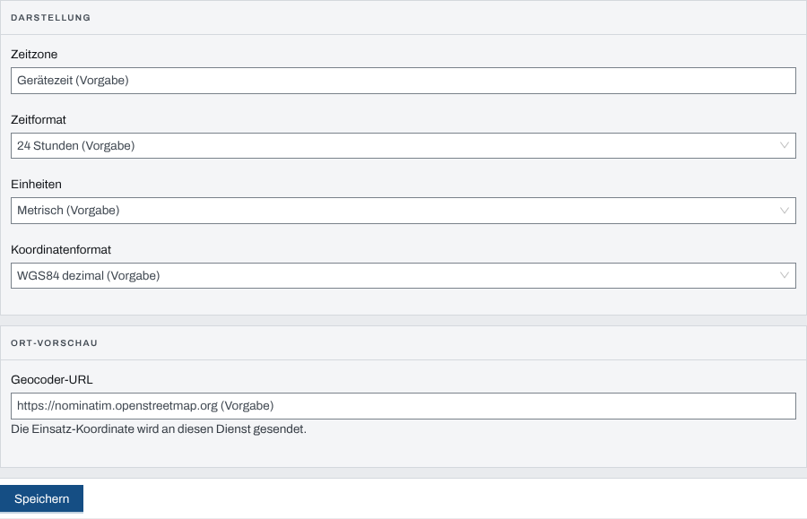
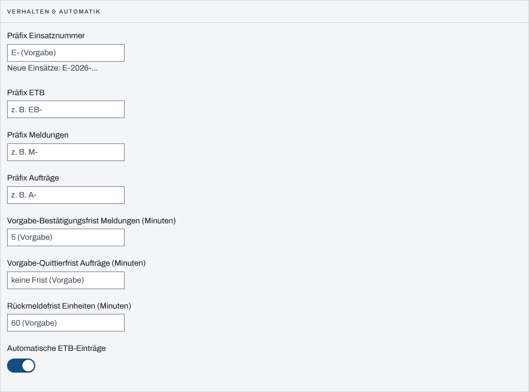
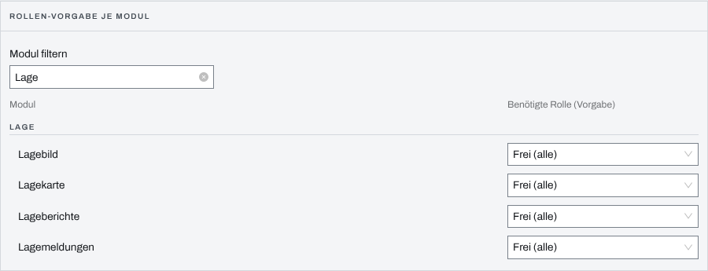

## Überblick

Unter „Einstellungen“ in der Verwaltung legt die Organisation fest, was für alle ihre Einsätze
gilt, solange ein Einsatz nichts Eigenes einstellt: die Darstellung, Nummern und Fristen, welche
Module eine Rolle verlangen und auf welchen Wegen sich Personen anmelden. Die Einstellungen
eines einzelnen Einsatzes beschreibt das Kapitel
[Einstellungen des Einsatzes und Module](einsatz-einstellungen.md).

Ändern dürfen nur System-Admins. Führungskräfte der Organisation sehen die Verwaltung zum
Nachschlagen.

## Abläufe

### Darstellung und Ortsdienst vorgeben

1. Oben „Verwaltung“ öffnen und unter „Einstellungen“ „Anzeige“ wählen.
2. Unter „Darstellung“ „Zeitzone“, „Zeitformat“, „Einheiten“ und „Koordinatenformat“ wählen.
3. Unter „Ort-Vorschau“ bei Bedarf eine eigene „Geocoder-URL“ eintragen.

   

4. „Speichern“ wählen. Die App meldet „Einstellungen gespeichert“.

### Nummern, Fristen und automatische ETB-Einträge vorgeben

1. Unter „Einstellungen“ „Einsatz-Vorgaben“ wählen.
2. Im Paneel „Verhalten & Automatik“ das „Präfix Einsatznummer“ und die Präfixe für ETB,
   Meldungen und Aufträge eintragen.
3. Die Vorgabe-Fristen für Meldungen und Aufträge und die „Rückmeldefrist Einheiten (Minuten)“
   eintragen.
4. „Automatische ETB-Einträge“ ein- oder ausschalten.

   

5. „Speichern“ wählen.

Unter dem Präfix der Einsatznummer zeigt „Neue Einsätze: …“, wie die nächste Nummer beginnt. Die
Paneele „Aufbewahrung“ und „Aufbewahrung je Datenkategorie“ auf derselben Seite beschreibt das
Kapitel [Aufbewahrung](aufbewahrung.md).

### Module für alle Einsätze auf eine Rolle beschränken

1. Unter „Einstellungen“ „Einsatz-Vorgaben“ wählen.
2. Im Paneel „Rollen-Vorgabe je Modul“ unter „Modul filtern“ einen Teil des Modulnamens
   eintippen.
3. Unter „Benötigte Rolle (Vorgabe)“ „Führung im Einsatz“, „Führungskraft der Organisation“
   oder „Admin“ wählen, zum Aufheben „Frei (alle)“.

   

Jede Wahl gilt sofort, ohne „Speichern“. Die App meldet „Modul-Vorgabe gespeichert“.

### Anmeldeverfahren ein- oder ausschalten

1. Unter „Einstellungen“ „Anmeldeverfahren“ wählen.
2. Im Paneel „Anmeldewege“ den Schalter des Verfahrens umlegen.

Jede Umschaltung gilt sofort.

## Hintergrund

### Welche Vorgabe wo gilt

Jede Vorgabe gilt für alle Einsätze der Organisation, die keinen eigenen Wert gesetzt haben,
auch für laufende. Ein Einsatz mit eigenem Wert behält ihn. Fehlt auch die Vorgabe, gilt die des
Systems; die Felder zeigen sie mit dem Zusatz „(Vorgabe)“. Im Einsatz erscheint ein Wert der
Organisation als „Vorgabe der Organisation: …“.

Das „Präfix Einsatznummer“ gilt nur für neue Einsätze; vergebene Einsatznummern bleiben.

### Rollen-Vorgabe

Die Rolle wirkt wie die „Benötigte Rolle“ im Einsatz: „Führung im Einsatz“ lässt Einsatzleitung
und Führungspersonal jedes Einsatzes sowie Führungskräfte der Organisation hinein, „Führungskraft
der Organisation“ nur Führungskräfte der Organisation, „Admin“ nur System-Admins; System-Admins
kommen immer hinein. Was die Stufen im Einzelnen bedeuten, beschreibt das Kapitel
[Einstellungen des Einsatzes und Module](einsatz-einstellungen.md) unter „Was ‚Sichtbar‘ und
‚Benötigte Rolle‘ bewirken“. Die Einsatzleitung eines Einsatzes kann die Vorgabe für ihren Einsatz
mit einem eigenen Wert ersetzen.

### Ort-Vorschau

Die Ort-Vorschau nennt zu einer eingegebenen Koordinate den nächsten Ortsnamen, damit
Zahlendreher auffallen. Dafür schickt der Server die Koordinate an den Dienst unter
„Geocoder-URL“, ohne eigenen Eintrag an `https://nominatim.openstreetmap.org`. Wer keine
Koordinaten an einen fremden Dienst geben will, trägt einen eigenen ein.

### Anmeldeverfahren

Die Liste zeigt nur Verfahren, die beim Start des Servers eingerichtet wurden, etwa „Passwort“,
„PocketID“ oder „Passkey“. Ein abgeschaltetes Verfahren steht für die Anmeldung nicht mehr zur
Verfügung. „Passwort“ ist „nicht deaktivierbar“: es ist der Weg, auf dem sich ein System-Admin
immer anmelden kann. Wie Personen sich anmelden, beschreibt
[Anmelden und Abmelden](anmelden-abmelden.md).

### Wer was darf

Die Verwaltung erreichen System-Admins und Führungskräfte der Organisation. Ändern dürfen nur
System-Admins; alle anderen sehen „Nur Ansicht · nur System-Admin“.
