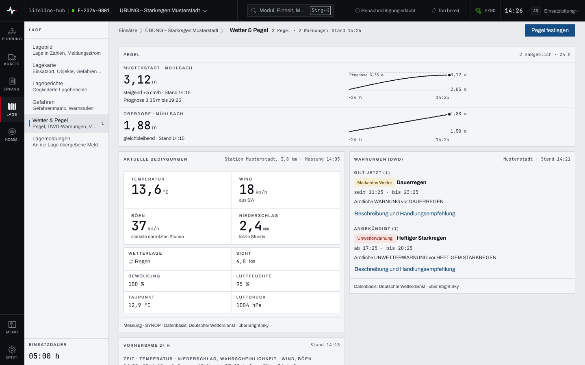
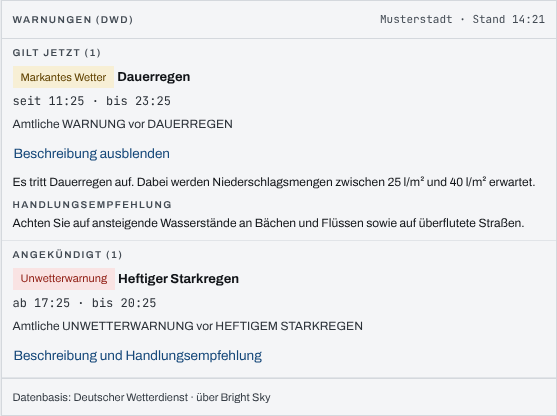
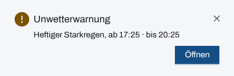
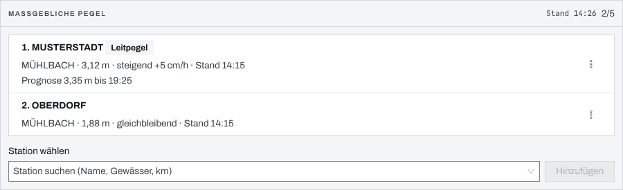
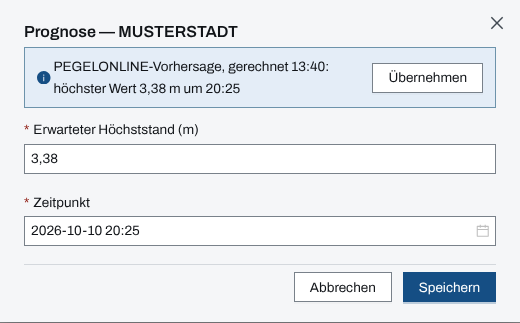

## Überblick

„Wetter & Pegel“ zeigt, was von außen auf den Einsatz wirkt: die Wasserstände der maßgeblichen
Pegel mit Verlauf und Prognose, die aktuellen Wetterbedingungen am Einsatzort, die amtlichen
Warnungen des Deutschen Wetterdienstes und die Vorhersage für 24 Stunden. Welche Pegel maßgeblich
sind, legt die Führung in den Einstellungen des Einsatzes fest. Eine neue Unwetterwarnung meldet
die App von selbst.

## Abläufe

### Wetter und Pegel ansehen

1. Im Bereich „Lage“ „Wetter & Pegel“ öffnen.
2. Im Paneel „Pegel“ je Station den Wasserstand, den Trend („steigend“, „gleichbleibend“), die
   Zeit der Messung, eine erfasste Prognose und den Verlauf der letzten 24 Stunden lesen.

   

3. Darunter „Aktuelle Bedingungen“ (Messung der nächsten Station), „Warnungen (DWD)“ und
   „Vorhersage 24 h“ lesen.
4. Um die maßgeblichen Pegel zu ändern, „Pegel festlegen“ im Seitenkopf wählen. Es öffnen sich die
   Einstellungen des Einsatzes bei „Pegel“.

### Eine Warnung im Wortlaut lesen

1. Im Paneel „Warnungen (DWD)“ die Warnung suchen. Unter „Gilt jetzt“ stehen die laufenden, unter
   „Angekündigt“ die kommenden, je mit Stufe, Ereignis und Zeitraum.
2. „Beschreibung und Handlungsempfehlung“ wählen.

   

3. Zum Schließen „Beschreibung ausblenden“ wählen.

### Auf einen Unwetterhinweis reagieren

1. Erscheint rechts oben der Hinweis „Unwetterwarnung“ mit Ereignis und Zeitraum, „Öffnen“ wählen.

   

2. „Wetter & Pegel“ öffnet sich; die Warnung steht unter „Warnungen (DWD)“.

### Maßgebliche Pegel festlegen

1. In den Einstellungen des Einsatzes „Pegel“ öffnen. Unter „Maßgebliche Pegel“ stehen die
   festgelegten Stationen; der erste ist der „Leitpegel“.

   

2. Unter „Station wählen“ nach Name, Gewässer oder Flusskilometer suchen und die Station wählen.
3. „Hinzufügen“ wählen. Die App meldet „Pegel gespeichert“; die Station steht am Ende der Liste.

### Eine Prognose erfassen

1. In den Einstellungen bei „Pegel“ das Menü der Station öffnen und „Prognose erfassen …“ wählen.
2. Liefert PEGELONLINE für die Station eine Vorhersage, steht ihr höchster Wert oben im Dialog.
   „Übernehmen“ trägt ihn ein.

   

3. „Erwarteter Höchststand (m)“ und „Zeitpunkt“ prüfen oder selbst eintragen.
4. „Speichern“ wählen. Die App meldet „Prognose gespeichert“; die Zeile nennt die Prognose.

## Hintergrund

### Pegel und Prognose

- Höchstens fünf Pegel sind maßgeblich; danach meldet die Liste „Maximum erreicht“.
- Das Menü jeder Zeile („Aktionen zu Pegel …“) ordnet mit „Nach oben“ und „Nach unten“ um und
  nimmt eine Station mit „Entfernen“ aus der Liste.
- Der **Leitpegel** steht im Lagebild als erste Kennzahl (Kapitel [Lagebild](lagebild.md)) und im
  Überblick an der Warnstufe.
- Die Prognose ist eine Angabe der Führung: Die App setzt die Vorhersage von PEGELONLINE nie von
  selbst ein, sie bietet sie nur zum Übernehmen an. Der erwartete Höchststand erscheint im
  Überblick unter „Nächste Marken“, bis sein Zeitpunkt verstrichen ist.
- Eine verstrichene Prognose steht als „abgelaufen“ da, bis sie geändert oder gelöscht wird
  („Prognose ändern …“, „Prognose löschen“ im Menü der Station). Ein Löschen lässt sich über die
  Meldung rückgängig machen; „Entfernen“ fragt nicht nach, die Station lässt sich wieder
  hinzufügen.
- Ist PEGELONLINE nicht erreichbar, sagt ein Hinweis das; die festgelegte Liste bleibt bedienbar,
  nur das Hinzufügen wartet.

### Wetter

- Das Wetter gilt für den Einsatzort. Ist er nicht verortet, steht „Einsatzort nicht verortet“
  mit dem Knopf „Einsatzort in den Einsatzdaten verorten“.
- „Aktuelle Bedingungen“ ist eine Messung naher Stationen, keine Modellrechnung; ihr Stand ist die
  Messzeit. „Vorhersage 24 h“ zeigt Dreistundenschritte. Datenbasis ist der Deutsche Wetterdienst,
  bezogen über Bright Sky.
- Jeder Teil nennt seinen Stand. Ein veralteter Stand bleibt mit seiner Zeit sichtbar; ist eine
  Quelle ausgefallen, steht „Stand unbekannt“ statt einer Liste.

### Der Unwetterhinweis

Der Hinweis „Unwetterwarnung“ erscheint bei einer neuen, gültigen Warnung der amtlichen Stufe
schwer oder extrem am Einsatzort, mit einem dezenten Ton, auf jeder Seite des Einsatzes und, wenn
Benachrichtigungen erlaubt sind, auch im verdeckten Tab. Je Person und Einsatz meldet die App
dieselbe Warnung nur einmal. Warnungen geringer und mäßiger Stufe stehen nur auf der Seite. Der
Beginn einer angekündigten Unwetterwarnung steht zudem im Überblick unter „Nächste Marken“.

### Rechte und ohne Netz

Lesen kann jede Person im Einsatz. Pegel festlegen, umordnen und Prognosen erfassen braucht das
Schreibrecht: Einsatzleitung oder Führungspersonal in einem laufenden Einsatz (Kapitel
[Rechte im Einsatz](rechte-im-einsatz.md)). Wetter und Pegel kommen aus externen Quellen und
brauchen Netz; die App hält sie für die Arbeit ohne Netz nicht vor (Kapitel
[Arbeiten ohne Netz](ohne-netz.md)).
