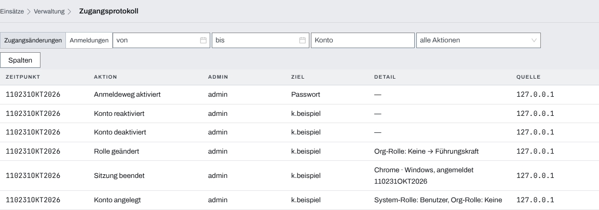
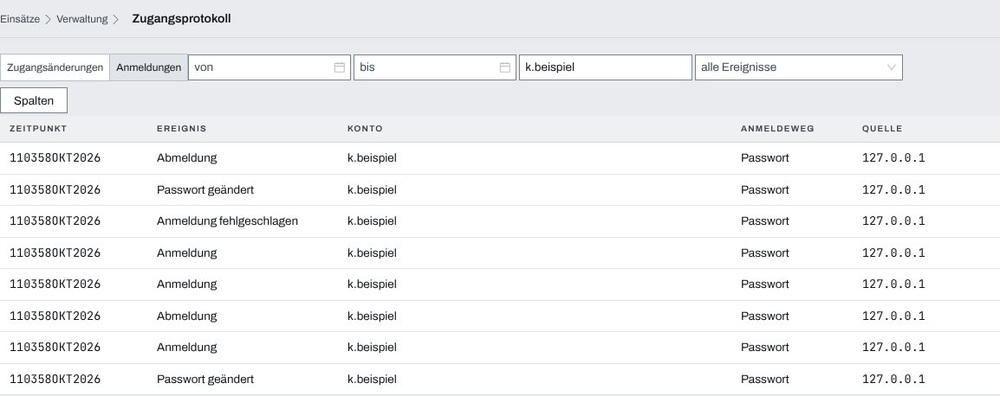
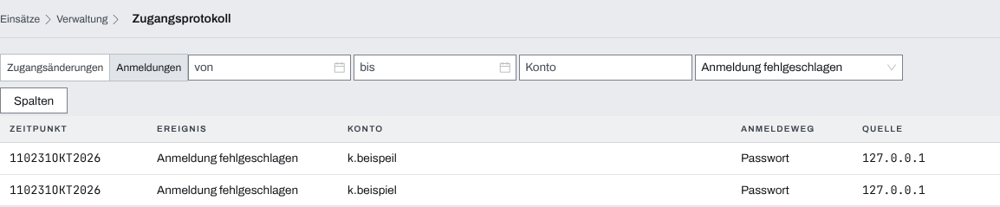

## Überblick

Das Zugangsprotokoll in der Verwaltung beantwortet zwei Fragen: wer hat wann den Zugang zu
Lifeline Hub verändert, und wer hat sich wann angemeldet oder es vergeblich versucht. Dafür hat
die Seite zwei Spuren, „Zugangsänderungen“ und „Anmeldungen“, jede mit den neuesten Einträgen
zuerst. Die Einträge schreibt der Server selbst; ändern oder löschen lässt sich keiner.

Lesen dürfen nur System-Admins.

## Abläufe

### Zugangsänderungen nachsehen

Für System-Admins:

1. Oben „Verwaltung“ öffnen und „Zugangsprotokoll“ wählen. Die Seite zeigt die Spur
   „Zugangsänderungen“.
2. Je Zeile ablesen, wann („Zeitpunkt“) welcher Admin („Admin“) was getan hat („Aktion“), an
   welchem Konto oder Anmeldeweg („Ziel“), und von welcher Adresse aus („Quelle“).

   

3. Bei Bedarf unter „Aktion“ eine Aktion wählen, etwa „Rolle geändert“.
4. Reicht die Liste nicht weit genug zurück, am Ende „Ältere laden“ wählen.

### Anmeldungen eines Kontos prüfen

Für System-Admins:

1. Im Zugangsprotokoll in der Leiste oben „Anmeldungen“ wählen.
2. Im Feld „Konto“ den Benutzernamen eintragen oder aus den Vorschlägen wählen.

   

3. Bei Bedarf mit „von“ und „bis“ den Zeitraum eingrenzen.

Mit dem Text im Feld „Konto“ zeigt auch die Spur „Zugangsänderungen“ nur noch Einträge der
Konten, deren Name ihn enthält.

### Fehlgeschlagene Anmeldeversuche finden

Für System-Admins:

1. Im Zugangsprotokoll „Anmeldungen“ wählen.
2. Unter „Ereignis“ „Anmeldung fehlgeschlagen“ wählen.

   

3. Unter „Konto“ steht der Name, mit dem es versucht wurde, auch einer, zu dem es kein Konto
   gibt; unter „Quelle“ die Adresse, von der der Versuch kam.

## Hintergrund

### Zugangsänderungen

Eine Zeile entsteht, nachdem ein System-Admin eine dieser Aktionen ausgeführt hat; eine
abgewiesene Aktion hinterlässt nichts.

- **„Konto angelegt“**: unter „Benutzer“ mit „Benutzer anlegen“. „Detail“ nennt die beiden
  Rollen, etwa „System-Rolle: Benutzer, Org-Rolle: Keine“.
- **„Rolle geändert“**: System- oder Org-Rolle im Dialog „Benutzer bearbeiten“ geändert.
  „Detail“ nennt alte und neue Rolle, etwa „Org-Rolle: Keine → Führungskraft“. Eine reine
  Änderung des Anzeigenamens schreibt nichts.
- **„Konto deaktiviert“** und **„Konto reaktiviert“**: unter „Benutzer“.
- **„Sitzung beendet“**: eine Anmeldung der Person unter „Benutzer“, „Anmeldungen“ beendet, eine
  Zeile je Anmeldung. „Detail“ nennt das Gerät und den Zeitpunkt der Anmeldung, in derselben
  Form wie die Spalte „Zeitpunkt“.
- **„Einmalpasswort vergeben“**: im Dialog „Benutzer bearbeiten“. Ohne „Detail“, das Passwort
  steht nie in der Spur. Die Anmeldungen, die dabei enden, stehen nicht einzeln da.
- **„Anmeldeweg aktiviert“** und **„Anmeldeweg deaktiviert“**: jedes Schalten unter
  „Einstellungen“, „Anmeldeverfahren“, auch wenn der Weg schon so stand. „Ziel“ ist dann der
  Anmeldeweg, etwa „Passwort“ oder „SSO“.
- **„Zweitfaktor zurückgesetzt“**: steht in der Auswahl; die Oberfläche der Verwaltung bietet
  das Zurücksetzen derzeit nicht an.

Die Rollen heißen in „Detail“ so wie im Dialog „Benutzer bearbeiten“. Einträge, die vor dem
Update mit diesem Klartext entstanden sind, behalten ihre alte Form, etwa
„org_rolle: keine → fuehrungskraft“ oder eine Zeit in UTC; sie verschwinden mit ihrer Frist.

Wie die Aktionen selbst gehen, beschreiben [Benutzer](benutzer.md) und
[Verwaltung](verwaltung.md).

### Anmeldungen

- **„Anmeldung“**: eine Anmeldung ist gelungen, mit Passwort, SSO, Passkey oder zweitem Faktor,
  ebenso das Koppeln eines Geräts und die Anmeldung der Mac-App über den Browser. Wer einen
  zweiten Faktor eingerichtet hat, ist erst nach dem Code angemeldet; das Passwort allein
  schreibt noch keine Zeile. Ebenso schreibt ein Einmalpasswort allein noch keine Zeile: Mit dem
  Festlegen des eigenen Passworts entstehen „Passwort geändert“ und „Anmeldung“. Mit zweitem
  Faktor steht „Anmeldung“ schon nach dem Code, beim Festlegen folgt nur „Passwort geändert“.
- **„Anmeldung fehlgeschlagen“**: falsches Passwort, unbekannter Name, falscher Code des zweiten
  Faktors, abgewiesener Passkey oder SSO-Rücksprung, ungültiger Kopplungscode.
- **„Abmeldung“**: die Person hat „Abmelden“ gewählt.
- **„Passwort geändert“** und **„Passwortwechsel abgewiesen“**: die Person hat im Profil ihr
  Passwort gewechselt bzw. dabei das bisherige Passwort falsch eingegeben, siehe
  [Profil und Sicherheit](profil-sicherheit.md). Gelingt der Wechsel, enden ihre anderen
  Anmeldungen ohne eigene Zeile.
- **„Sitzung beendet“**: die Person hat im Profil unter „Anmeldungen“ ein anderes Gerät
  abgemeldet, eine Zeile je Gerät. Beendet ein Admin, steht es unter „Zugangsänderungen“.

Was nichts schreibt: das Deaktivieren eines Kontos beendet dessen Anmeldungen ohne eigene Zeile
in dieser Spur, und eine Anmeldung, die nur abläuft, endet still.

### Die Spalten

- **„Konto“**: der angemeldete Name, beim Fehlversuch der versuchte. Gekoppelte Geräte stehen mit
  ihrem Gerätekonto „geraet-…“. Namen über 64 Zeichen stehen gekürzt mit „…“.
- **„Anmeldeweg“**: „Passwort“, „SSO“, „Passkey“, „Zweiter Faktor“ (Passwort und Code),
  „Gerätecode“ (gekoppelte Geräte) oder „Mac-App“ (Anmeldung der Mac-App über den Browser). Bei
  „Abmeldung“ und „Sitzung beendet“ steht der Weg, auf dem die beendete Anmeldung entstand. Ist
  er nicht bekannt, steht „—“: so bei Anmeldungen, die schon vor dem Update mit diesem Klartext
  bestanden. Ältere Abmeldungen zeigen noch „Passwort“, auch wenn die Anmeldung anders entstand.
- **„Quelle“**: die IP-Adresse, von der die Anfrage kam. Steht der Server hinter einem
  Reverse-Proxy, ist das nur dann die Adresse des Geräts, wenn der Betrieb den Proxy als
  vertrauenswürdig eingetragen hat; sonst steht dort die Adresse des Proxys.
- **„Zeitpunkt“**: in Zeitzone und Zeitformat der Organisation (Verwaltung, „Anzeige“).

### Suchen und Filtern

- „von“ und „bis“ schließen die genannten Zeitpunkte ein.
- „Konto“ trifft jeden Benutzernamen, der den eingetragenen Text enthält; „rub“ findet „ruben“
  und „rubina“. Groß- und Kleinschreibung zählen nicht. Die Liste folgt schon beim Tippen. In
  „Zugangsänderungen“ trifft das Konto sowohl den handelnden Admin als auch das Zielkonto, nie
  einen Anmeldeweg gleichen Namens.
- Die Filter stehen in der Adresse der Seite; ein Lesezeichen oder ein geteilter Link öffnet
  dieselbe Auswahl.
- Die Liste lädt beim Öffnen und bei jedem Filterwechsel je 100 Einträge, weitere mit „Ältere
  laden“. Was danach geschieht, erscheint erst nach erneutem Öffnen oder einem Filterwechsel.

### Wie lange die Einträge bleiben

- **Anmeldungen**: 90 Tage.
- **Zugangsänderungen**: 365 Tage, weil eine missbräuchliche Änderung oft erst spät auffällt.

Ältere Einträge löscht der Server von selbst; er prüft alle zehn Minuten. Beide Fristen sind
fest und hängen an keinem Einsatz; die Fristen der Einsätze beschreibt
[Aufbewahrung](aufbewahrung.md).

### Wer das Protokoll sieht

- Nur System-Admins. Für Führungskräfte fehlt der Eintrag in der Verwaltung; wer die Adresse
  direkt öffnet, landet auf der ersten Seite der Verwaltung.
- Das Protokoll umfasst alle Konten des Servers, nicht nur die der eigenen Organisation.
- Das Lesen selbst hinterlässt keinen Eintrag.

### Lücken

Klemmt die Datenbank beim Schreiben eines Eintrags, geht die Anmeldung bzw. die Aktion trotzdem
durch, und der Eintrag fehlt. Der Server vermerkt das in seinem Betriebsprotokoll. Bei einem
Verdacht, etwa einem verlorenen Gerät, hilft das Zugangsprotokoll beim Nachvollziehen, siehe
[Gerät verloren](geraet-verloren.md).
